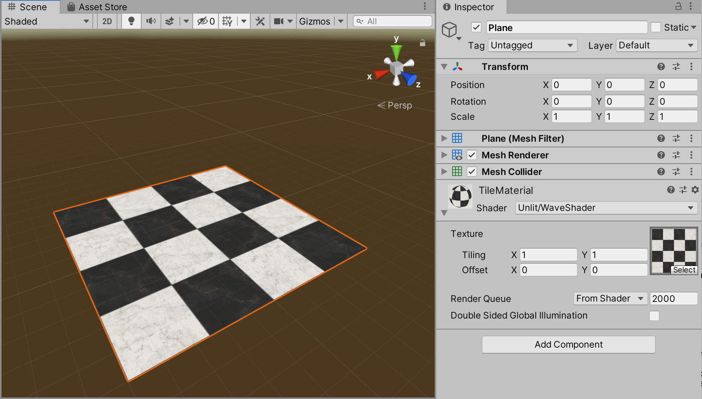
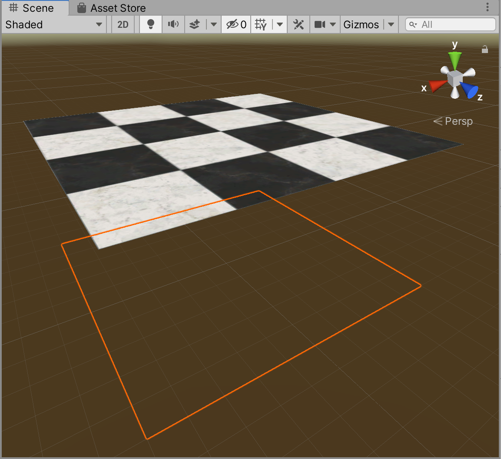
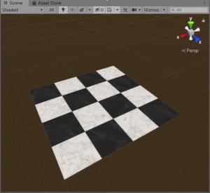
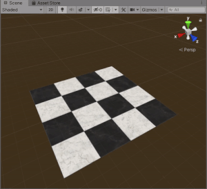
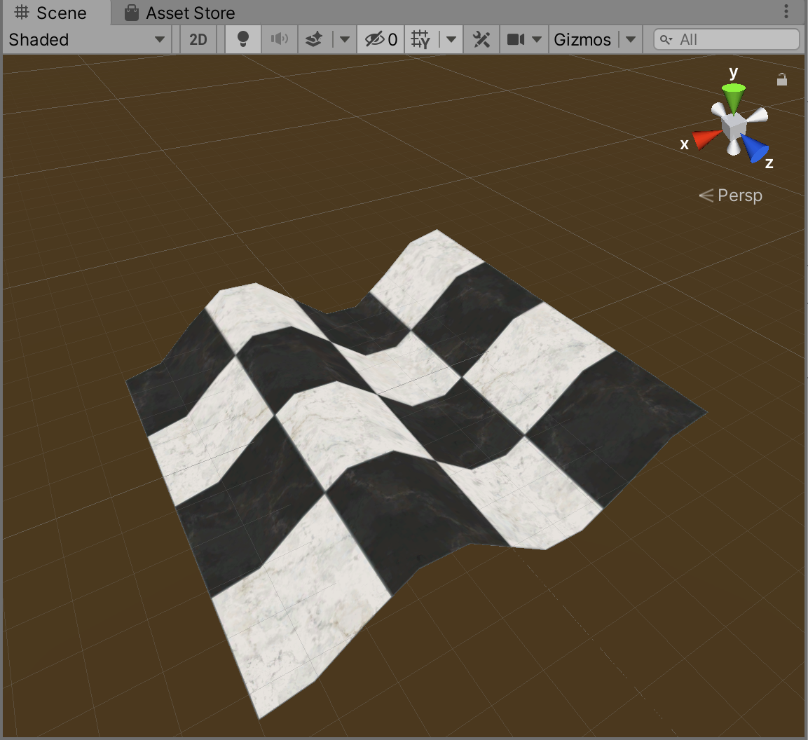
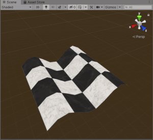
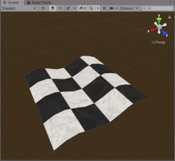
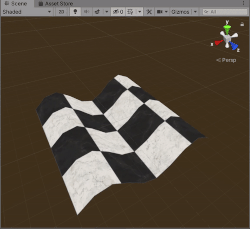

**The University of Melbourne**
# COMP30019 – Graphics and Interaction

## Workshop 7


# Introduction:

In this workshop you will continue learning about shaders, with a 
particular emphasis on vertex shaders. Vertex shaders are useful for 
manipulating meshes in real-time without needing to continually regenerate 
geometry on the CPU, which is typically a lot slower. A vertex shader
is actually rather simple -- it's a _function_ that takes an untransformed
vertex as input, transforms it in some way, and returns the transformed
vertex for use in subsequent rendering pipeline stages. 

You will need to work with these files to start off with:
* **MainScene.unity** – The scene you'll need to open and modify, as usual.
* **TileTex.png** – A checkerboard tile image currently used as a texture.
* **TileMaterial.mat** – A Unity material using the checkerboard texture.
* **WaveShader.shader** – A Cg/HLSL shader which defines behaviour in parts of the rendering
pipeline. Note that this is not executed on the CPU, but rather the GPU (on a graphics card).

### Tasks

#### 1. Assign the wave shader to the plane's material
After opening `MainScene.unity` in Unity, you should see a textured plane 
on the screen. Currently the ‘Standard’ Unity shader is 
applied to the plane. Your first task is to assign the shader 
`WaveShader.shader` to the plane. This can be done without any coding.
(Recall that shaders are assigned via an object’s material, and here the material
is an asset file in the project...)

<p align="center">
  
</p>

#### 2. Hardcode some linear transformations
Open `WaveShader.shader` and examine the vertex shader. Take note of the 
displacement vector. What effect does it have, if any, currently? Is it
applied before or after the MVP transform?

> **Note**<br>
> For the next tasks, namely
> up until task 6, you only need to modify this 
> vector to solve the respective problems!

* Modify the displacement vector so that the plane is displaced 5 units in the y-axis (‘up’).

<p align="center">
  
</p>

* Modify the vector so that the plane moves upwards. A built-in uniform variable 
  named `_Time.y` should help here. Note that `_Time` is a `float4` whereby the 
  `y` component contains the number of seconds elapsed since the start of 
  the scene. For more details see [this page](https://docs.unity3d.com/Manual/SL-UnityShaderVariables.html).

<p align="center">
  
</p>

* Modify the vector so that the plane smoothly oscillates up and down in the y-axis. Feel free to use the built-in HLSL [`sin()`](https://docs.microsoft.com/en-us/windows/win32/direct3dhlsl/dx-graphics-hlsl-sin) function to assist with this.

<p align="center">
  
</p>

So far everything you have done could have easily been achieved by 
setting the object’s transform in the Unity editor (i.e., via the MVP matrix). 
Now you will implement an effect which would be impossible to 
achieve by doing this alone. This is where vertex shaders start to shine!

#### 3. Make some waves...
Use the built-in `sin()` function to displace the y-coordinate of each 
vertex _in terms of_ its x-coordinate according to the formula `y = sin(x)`. 
Once this is implemented, you should see a wave effect applied to the plane.

<p align="center">
  
</p>

#### 4. Animate them!
Animate the effect such that waves continuously move through the plane 
in the x-axis. Use a similar technique to how you animated the plane 
in question 2.

<p align="center">
  
</p>

#### 5. Change their parameters
Further modify the shader such that:
* The amplitude of the waves is halved.
* The speed of the waves is doubled.
* The speed of the waves increases with time.

<p align="center">
  
  
  
</p>

#### 6. Understanding M(VP)

Create a few duplicates of the plane game object. Place these duplicates in 
random locations in the scene,
and arbitrarily rotate/scale them. Use their individual **Transform** components 
to do this, like you would with any game object. Notice that the wave effect is _relative_ to 
each individual plane's *local* coordinate system, _not_ the world's. That's 
because the wave transformation is occuring in model coordinates. Indeed, if you examine the 
shader again
you'll see that the MVP transformation is occuring _after_ the wave transformation. 

Recall that `UNITY_MATRIX_MVP` captures three linear transformations "in sequence": 
1. Transforms vertices from model coordinates to world coordinates, essentially the object's `Transform`.
2. Transforms vertices from world coordinates to view coordinates, such that the camera is at (0, 0, 0) looking "forward" (identity transform). This
is the _inverse_ of the camera game object's `Transform`. 
3. Projects vertices in view coordinates to normalised screen coordinates ("2D" space), either using perspective or orthographic projection.

> **Note**<br>
> Given the world is 3D, it might surprise you that the MVP matrix is four dimensional (4x4). 
> At risk of over-simplifying some [complex but very interesting maths](https://en.wikipedia.org/wiki/Homogeneous_coordinates#Use_in_computer_graphics_and_computer_vision),
> the core reason for this is that we are 
> capturing translation as part of the matrix, rather than keeping a separate vector alongside it.

Simply as an academic exercise, replace `UNITY_MATRIX_MVP` with `UNITY_MATRIX_VP` in 
the wave shader. 
This is a partial product of MVP where `M` has been omitted.
In other words, there is no longer a transformation from model coordinates
to world coordinates.
Return to the scene and you'll see that there is only **one** wave at the origin
of the world... the duplicates are gone!

...or are they? In fact, from Unity's CPU-side of things, nothing changed. The
duplicates are still there in the object hierarchy, 
and the **Transform** components still have the same
values as before (verify this!). What we've done
is _ignore_ the individual object transforms on the GPU side. This
is a purely visual effect, and kind of pointless in this example,
but shows how powerful shaders are. Unity provides
the data to correctly transform objects, but leaves it up to **you**, the shader
writer, to actually use this data to render objects how you see fit!

#### 7. What about V?

Try doing the same thing as in the previous task, but this 
time omit the `V` matrix rather than `M`. Unfortunately there is
no `UNITY_MATRIX_MP` matrix, so you'll need to construct it yourself 
using the HLSL `mul` function. 

> **Warning**<br>
> The model matrix doesn't follow the `UNITY_MATRIX_*` naming convention that
> the others do. Once again,
> [this](https://docs.unity3d.com/Manual/SL-UnityShaderVariables.html) page should come
> in handy if you forgot the names of the partial matrix products available.

When this is working, assuming you haven't moved the original plane from the
origin, it should be "in your face" no matter what the camera orientation is. 
Perhaps unsurprisingly, 
removal of `V` simply ignores the camera transform, in the same way that
removal of `M` ignores the object's transform. Again, this is a purely visual effect
in the shader. The camera component/transform has not changed at all on the CPU end,
we're just not utilising it during rendering!

#### 8. Relativity please...
Now it's time to put your knowledge of MVP partial products to the test _for real_. 

Modify the shader such that the wave effect is occurring in view space rather than 
model space. This will result in the waves travelling through the object relative 
to the camera’s orientation. You should verify the effect works by switching to 
the ‘Scene’ tab and rotating camera around. 


<p align="center">
  
</p>

#### 9. Do-it-yourself MVP (challenge)

So how exactly does Unity construct `UNITY_MATRIX_MVP`? Turns out it's not magic,
but there's a good reason why you don't see the gory details behind it.
There's a fair bit of internal complexity to do with cross-platform handling of 
underlying graphics APIs -- primarily DirectX or OpenGL (among a few others).
If you want to go a down a rabbit hole that will deepen
your understanding of the internal workings here, continue on.

Your task is to manually
construct the MVP matrix in a C# component, attached to the plane. This should
replace the `UNITY_MATRIX_MVP` in the wave shader, via a uniform property you should define like so:

```HLSL
uniform float4x4 _CustomMVP
```

On every update, you should re-construct it and make it available within the wave shader
via the plane's material. To keep things simple, you
may assume only one camera is rendering the object per frame, namely the **Main Camera** game
object (don't worry about getting the scene view camera working). Simply use a `[SerializeField] private Camera ...`
field to reference the `Camera` component.

There are a few classes/utilities you may use to make your life easier:
- Unity comes with a [`Matrix4x4`](https://docs.unity3d.com/ScriptReference/Matrix4x4.html) class to represent a matrix, so you don't need to do this.
- The `Material` class has a [`SetMatrix`](https://docs.unity3d.com/ScriptReference/Material.SetMatrix.html) method utilising to this class. This lets you pass a matrix to a shader.
- You may use [`Matrix4x4.TRS`](https://docs.unity3d.com/ScriptReference/Matrix4x4.TRS.html), a helper function that constructs a matrix from a `Vector3` position, `Quaternion` rotation and `Vector3` scale.
- You may use [`Matrix4x4.Perpsective`](https://docs.unity3d.com/ScriptReference/Matrix4x4.Projection.html) to assist with generating the projection matrix.

> **Note**<br>
> It might help to solve this problem one matrix at a time. The `M` matrix is simplest, so start
> with that one. To test that it's working, pass it to your shader then multiply it by
> `UNITY_MATRIX_VP`, which you know is correct. 

Note that to fully solve this problem you'll need to consider how coordinate systems vary between DirectX and OpenGL. 
While Unity scenes and HLSL code both assume left-handed coordinates,
it's not so simple behind the scenes, as the 
underlying graphics API might not be DirectX. Also be aware that [HLSL may get cross-compiled](https://docs.unity3d.com/Manual/shader-compilation.html)
to the OpenGL equivalent (GLSL), again depending on the underlying graphics API. While you won't need
to work with GLSL code directly here, there is a presumption of right-handed 
coordinates being used in MVP (N.B. This is pretty complex stuff,
and the more you become aware of it, the more you appreciate using a pre-built game engine over rolling your own!)

All in all, this exercise will likely require a bit of trial and error, as well as research. Give it your
best shot, but don't worry if you can't figure everything out. A solution will be provided as usual.

Have fun!
